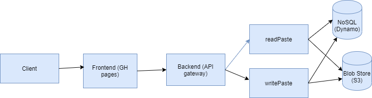
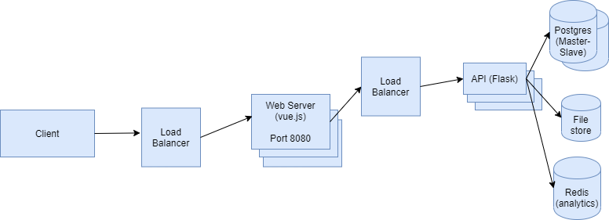

# System Design - Pastebin

Simple implementation of Pastebin. This repository will be helpful for those wishing to learn more about system design. I have written a simple REST api in flask and provided a few docker commands for spinning up a postgres database and redis cache. The frontend is a vue.js application.

I have provided some comments in this README on how to scale the design. The next step would be to pay for some cloud services (S3, etc.), setup some DNS entries and try hammering the API with a bunch of requests and see how it holds up.

The background schedulers for analytics and expiring old content are part of the flask application.

Based on suggestions in https://github.com/donnemartin/system-design-primer/blob/master/solutions/system_design/pastebin/README.md.

## Design

## Frontend

* Frontend written using ``vue.js`` (port 8080).

## Backend

* API written using ``flask`` (port 5000).
* Postgres database running using ``docker`` (port 5432).
* Redis cache running using ``docker`` (port 6379).

## Deployment

* vue app can be run on GitHub pages or Azure storage.
* flask api can be run on Heroku.
* postgres server can be from Heroku.
* redis cache can be from Heroku.

## Scaled Design

## Scaling

1. Instead of writing our files to ``file://localfolder/shortlink1.txt``, ``file:///localfolder/shortlink2.txt``, we can use a file store such as Amazon S3 to manage storing all of our files. We keep the S3 path in our database instead of our local path.

2. The API will need to run on multiple servers to handle all the traffic. We can setup DNS entries like ``pastebinapi.pastebin.com`` which will perform a round robin to ``server1.pastebin.com``, ``server2.pastebin.com``, etc. Assuming all the servers are equally powerful, this will evenly balance the load across all of our API servers.

3. We can add authentication to our API using ``Authorization`` header and JWT tokens. We are not passing any confidential data over the server, so security is not a big concern here.

4. Re. static content, we only have very basic HTML and JavaScript for our application so CDN is probably not necessary.

5. If we are using Azure Storage or GitHub pages to host our frontend, it should take care of the load balancing for our web server.

6. Reading the same file over and over would not be good. We could be caching GET requests with their result in a memory cache (to a limit of 25MB or something). This will reduce the number of times we need to read a file.

7. If our database goes down, our application won't work. We could have a master database and a failover database.

8. Re. the analytics, we currently write the analytics to the memory cache. It may be better to right the analytics to its own database.

